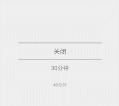

# Kotlin - PickerView 
Android选择器-基于RecycleRView
[](https://jitpack.io/#limxing/Kotlin-PickerView)




## Usage
#### Gradle

Project level build.gradle
```
buildscript {
    ext.kotlin_version = '1.3.21'
}
...
allprojects {
    repositories {
        maven { url 'https://jitpack.io' }
    }
}
```
App level build.gradle
```
dependencies {
    implementation 'com.github.limxing:Kotlin-VerificationView:1.0'
}
```

### XML
```
 <top.leefeng.libpickerview.PickerView
        android:id="@+id/pickerView"
        android:layout_width="200dp"
        android:layout_height="200dp"
        app:pv_number="5"
        app:pv_text_color="#666"
        app:pv_text_size="16dp" />

```

pv_number       显示个数（奇数）

pv_text_color   字体颜色

pv_text_size    字体大小

pv_line_height  分割线高度

pv_line_color   分割线颜色


### Code

kotlin
```kotlin
 pickerView.setData(arrayOf("关闭","30分钟","40分钟","50分钟","60分钟","70分钟","90分钟"),0)

 pickerView.currentItem
```


#### License
Kotlin-PickerView is available under the MIT license.
 